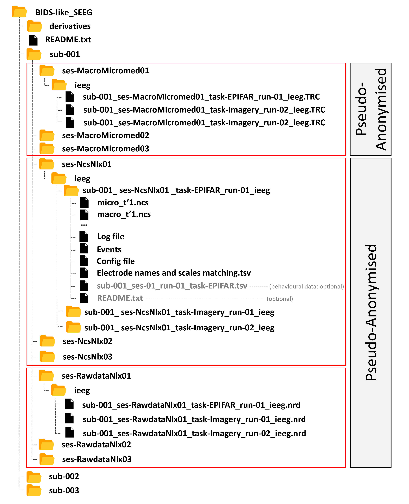

# 1. BIDS-like structure for Neuralynx hybrid data
This program allows the transformation of clinical data acquired with the Neuralynx (research macro- and micro-EEG) and Micromed (clinical macro-EEG) systems to meet the BIDS specifications in terms of tree structure and nomenclature. The term BIDS-like is used to indicate that only the BIDS tree structure and nomenclature are used for the moment, without the formats being BIDS-compatible (e.g. .ncs are not BIDS-compatible) nor the .json and .tsv files necessary for a complete BIDS structure being present.

Several major steps follow:
1. A dictionary is created, which references various information related to the BIDS-like tree. It will be used by the other functions (2,3,4) to generate the BIDS-like tree structure and the names of the folders, sub-folders and files.
2. A function that takes as input the path of the folder containing the .ncs (*Neuralynx* channel data) files renames the electrodes to add the recording scale (macro-EEG or micro-EEG). The name of the folder containing the .ncs files is also changed to follow the BIDS nomenclature (ex: sub-001_sess-01_task-Memory_run-01). The folder containing the .ncs is then removed (cut) from its original position to join the tree structure (folder) of our BIDS-like structure (pasted).
3. A function that takes as input the path of the .nrd file (*Neuralynx* raw data) will change the name of the file to match the BIDS nomenclature. The .nrd file is then removed (cut) from its original position to the tree (folder) of our BIDS-like structure (pasted).
4. A function that takes as input the path of the .TRC (*Micromed* raw data) file will change the name of the file to match the BIDS nomenclature. The .TRC file is then removed (cut) from its original position to join the tree structure (folder) of our BIDS-like structure (pasted).

The user can perform these actions one after the other or separately and individually. The only elements to be modified by the user are :
- The numbers of: patient, session, run,
- The name of the task,
- The symbol (letter[s]) used to characterise the microelectrodes (e.g. *tt* or *t*),
- The access paths to the various original files.

This adaptation of the BIDS structure was made to take into account the *hybrid* aspect of our intracerebral electrodes.



# 2. User need to fill this file for a new usage
A file named _**Electrode names and scales matching.tsv**_ must be present in the folder containing the channel data (.ncs). This file links the electrode names to the recording scale. If you are using conventional electrodes, the scale will always be *macro*. If you use hybrid electrodes, you will have to distinguish between the different types of electrodes by associating the label *macro* or *micro*. An example is available in the dataset proposed here.

## 2.1. Electrode names and scales matching (.tsv) example
```
electrode_name	recording_scale
ttb'	micro
tb'	macro
tb	macro
pp'	macro
pp	macro
of	macro
h	macro
```

# 3. Procedure example
User can use either the script directly (_**create_BIDS_tree.py"**_), or through the GUI provided with this program (_**start_app"**_).

## 3.1 Example using the script
User can use the program by simply running the script _**"create_BIDS_tree"**_. User will need to modify the paths, the patient/session/run numbers, the task name and the micro_identifier. For a no-coding procedure, user can use the GUI provided with this program.

```
### Set parameters
patient_num = 69
sess_num = 1
run_num = 1

task_name = "Stimic"
micro_identifier = "t"

BIDSlike_folderpath = r"folderpath/BIDS-like_Nlx"

### Process
#- Get path info and define BIDS-like path
path_info_dict = path_to_BIDSlikepath(patient_num, sess_num, run_num, BIDSlike_folderpath, task_name)

#- From current .ncs structure to BIDS-like .ncs structure
ncs_folderpath = r"folderpath"
ncs_destination = ncs_to_BIDSlike(ncs_folderpath, path_info_dict, micro_identifier, process = True)

#- From current .nrd structure to BIDS-like .nrd structure
rawdata_filepath = r"folderpath/filename.nrd"
rawdata_destination = rawdata_to_BIDSlike(rawdata_filepath, path_info_dict, process = True)

#- From current .TRC structure to BIDS-like .TRC structure
TRC_filepath = r"folderpath/filename.TRC"
TRC_destination = TRC_to_BIDSlike(TRC_filepath, path_info_dict, process = True)
```

## 3.2 Example using the GUI
To run the program, user can either open the script "_**open_GUI.py**_" using a python IDE, or simply double click the "_**start_app**_" file, that should automatically launch the GUI.


# 4. References
[1] Appelhoff, S., Sanderson, M., Brooks, T. L., van Vliet, M., Quentin, R., Holdgraf, C., Chaumon, M., Mikulan, E., Tavabi, K., Höchenberger, R., et al. (2019). Mne-bids : Organizing electrophysiological data into the bids format and facilitating their analysis. The Journal of Open Source Software, 4(44).

[2] Holdgraf, C., Appelhoff, S., Bickel, S., Bouchard, K., D’Ambrosio, S., David, O., Devinsky, O., Dichter, B., Flinker, A., Foster, B. L., et al. (2019). ieeg-bids, extending the brain imaging data structure specification to human intracranial electrophysiology. Scientific data, 6(1) :1–6.
